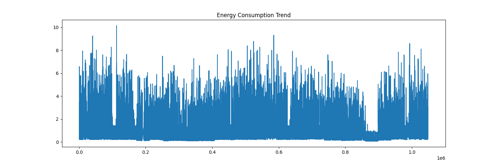
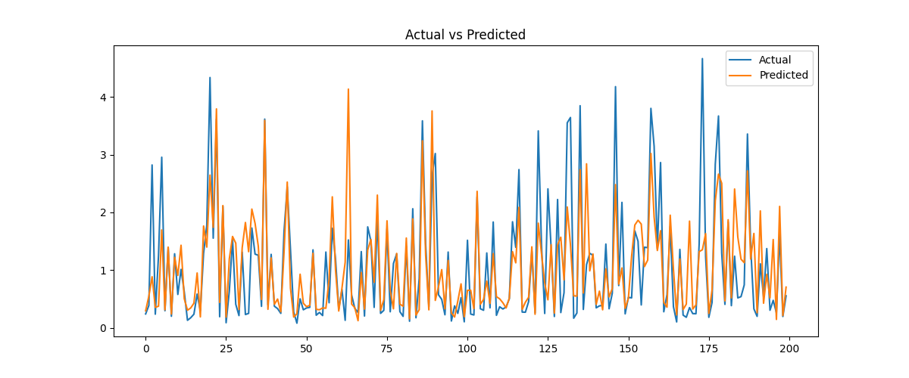
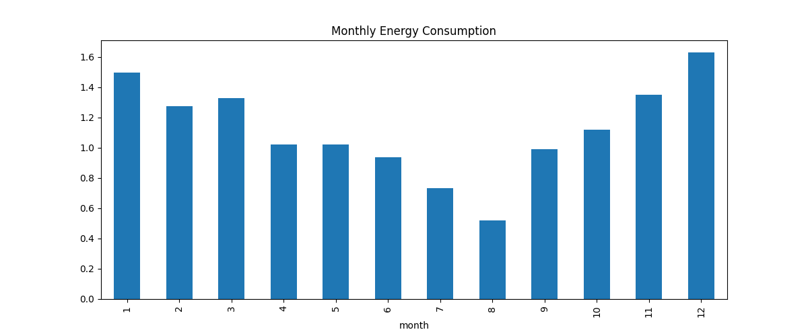
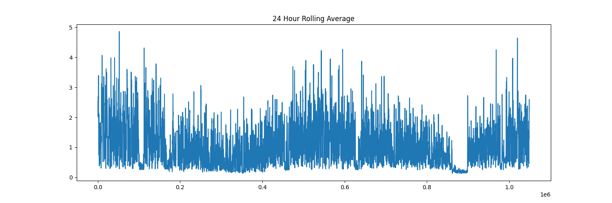

# ⚡ AI-Powered Smart Energy Forecasting & Consumption Analytics System


---

# 📌 Overview

This project is an advanced AI-powered energy forecasting system designed to predict future electricity consumption using machine learning and time-series analytics.

The system simulates how smart cities, electricity boards, renewable energy companies, manufacturing plants, and data centers optimize energy usage, reduce electricity wastage, and improve sustainability.

The project demonstrates real-world forecasting workflows used in climate-tech and smart-grid systems.

---

# 🚀 Industry Problem Being Solved

## ⚡ Unpredictable Energy Demand

Power grids often struggle to balance electricity generation and energy consumption.

This leads to:

* Blackouts
* Energy wastage
* Increased operational cost
* Poor renewable energy utilization
* Carbon emission growth

## ✅ AI-Based Solution

This forecasting system predicts future electricity demand so organizations can:

* Optimize power generation
* Reduce electricity wastage
* Improve smart-grid efficiency
* Support renewable energy planning
* Lower operational costs
* Improve sustainability goals

---

# 🏭 Industry Relevance

This project aligns with real-world use cases in:

* Smart Cities
* Electricity Boards
* Renewable Energy Companies
* Manufacturing Plants
* Data Centers
* Smart Buildings
* Climate-Tech Systems

Companies working in similar domains:

* Google
* Microsoft
* Tesla
* Siemens
* Schneider Electric
* IBM
* Tata Power
* General Electric
* NVIDIA

---

# 🧠 Technologies Used

| Category             | Technology             |
| -------------------- | ---------------------- |
| Programming Language | Python                 |
| Data Processing      | Pandas, NumPy          |
| Visualization        | Matplotlib, Seaborn    |
| Machine Learning     | Scikit-learn, XGBoost  |
| Models               | Random Forest, XGBoost |
| Model Serialization  | Joblib                 |
| IDE                  | VS Code                |
| Version Control      | Git & GitHub           |

---

# 🏗️ Project Architecture

```text
Historical Energy Dataset
            ↓
      Data Cleaning
            ↓
   Feature Engineering
            ↓
 Lag + Rolling Features
            ↓
     Train/Test Split
            ↓
  XGBoost Model Training
            ↓
      Model Evaluation
            ↓
   Future Energy Forecast
            ↓
   Analytics Visualization
            ↓
     Saved Predictions
```

---

# 📂 Folder Structure

```text
AI-Energy-Forecasting-System/
│
├── data/
│   ├── raw/
│   └── processed/
│
├── docs/
├── images/
├── models/
├── notebooks/
├── outputs/
├── src/
│   ├── data_loader.py
│   ├── preprocess.py
│   ├── feature_engineering.py
│   ├── train_model.py
│   ├── evaluate.py
│   ├── forecast.py
│   └── visualize.py
│
├── .gitignore
├── LICENSE
├── main.py
├── README.md
├── requirements.txt
└── test_model.py
```

---

# 📊 Dataset

Dataset Used:

Household Power Consumption Dataset

Dataset Link:

[https://www.kaggle.com/datasets/imtkaggleteam/household-power-consumption](https://www.kaggle.com/datasets/imtkaggleteam/household-power-consumption)

⚠️ Dataset is not uploaded to GitHub due to GitHub file size limitations.

After downloading:

1. Rename dataset to:

```text
energy_consumption.csv
```

2. Place inside:

```text
data/raw/
```

---

# ⚙️ Installation

## Clone Repository

```bash
git clone https://github.com/vyawaha/ai-energy-consumption-forecasting-system.git
```

---

## Create Virtual Environment

### Windows

```powershell
python -m venv venv
venv\Scripts\activate
```

### Mac/Linux

```bash
python3 -m venv venv
source venv/bin/activate
```

---

## Install Dependencies

```bash
pip install -r requirements.txt
```

---

# ▶️ Run Project

```bash
python main.py
```

---

# 📈 Evaluation Metrics

Example output:

```text
MAE: 0.4138
RMSE: 0.7109
R2 Score: 0.6198
```

---

# 📊 Visual Results

## ⚡ Energy Consumption Trend



---

## 📈 Actual vs Predicted Forecast



---

## 🏙️ Monthly Consumption Analysis



---

## 📉 Rolling Average Analysis



---

# 💾 Generated Outputs

The project automatically generates:

* Forecast CSV files
* Evaluation metrics
* Trained ML models
* Visualization graphs
* Prediction reports

---

# 🧪 Machine Learning Models Used

| Model                   | Purpose              |
| ----------------------- | -------------------- |
| Random Forest Regressor | Baseline forecasting |
| XGBoost Regressor       | Advanced forecasting |

---

# 🔥 Key Learning Outcomes

This project demonstrates:

* Time-Series Forecasting
* Feature Engineering
* Predictive Analytics
* Machine Learning Pipelines
* Real-World AI Workflows
* Climate-Tech Applications
* Energy Informatics
* Model Serialization
* GitHub Project Engineering

---

# 🌍 Real-World Impact

This project demonstrates how AI can:

⚡ Reduce electricity wastage
⚡ Prevent blackouts
⚡ Improve smart-grid systems
⚡ Support sustainable infrastructure
⚡ Optimize energy planning
⚡ Enable climate-tech innovation

---

# 🚀 Future Improvements

Possible future upgrades:

* LSTM Forecasting
* IoT Sensor Integration
* Real-Time Streaming Data
* Weather API Integration
* Dashboard Deployment
* Hyperparameter Tuning

---

# 🔗 Project Repository

GitHub Repository:

[https://github.com/vyawaha/ai-energy-consumption-forecasting-system.git](https://github.com/vyawaha/ai-energy-consumption-forecasting-system.git)

---

# 👨‍💻 Author

## Muktai Vyawahare

BTech CSE Student | AI & Data Science Enthusiast

Interested in:

* Machine Learning
* AI Systems
* Climate Tech
* Smart Grid Analytics
* Predictive Modeling

---

# ⭐ Support

If you like this project, give this repository a star ⭐
